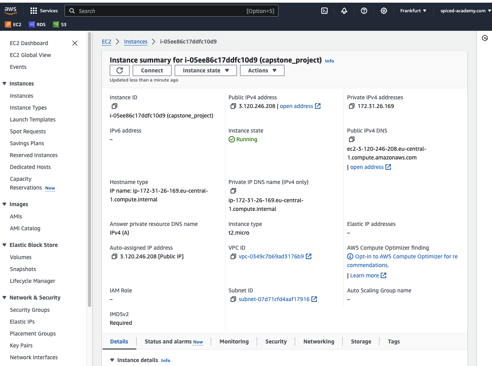
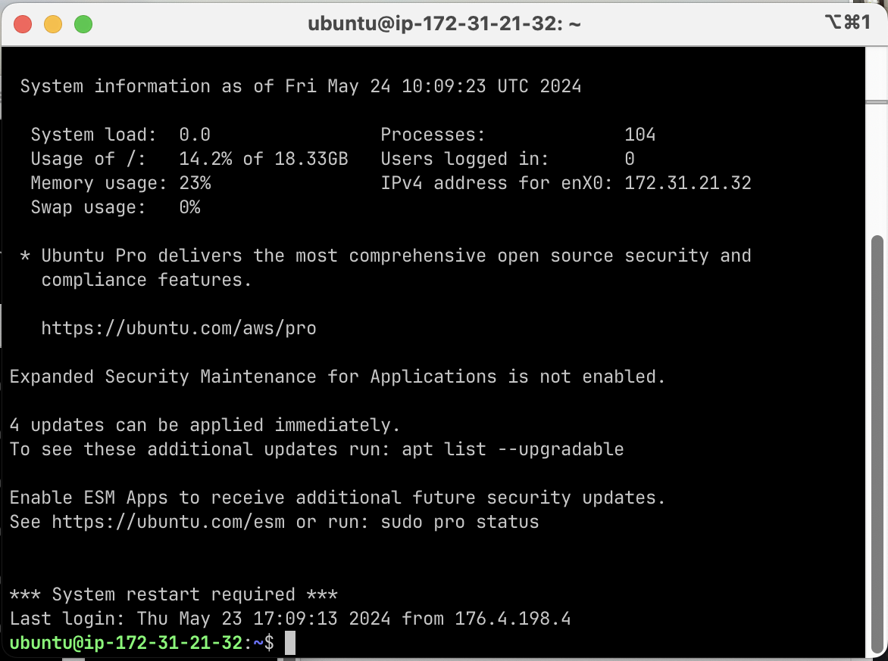

# Cloud computing using EC2

Welcome to the exciting world of the cloud! 🌍 In simple terms, "the cloud" refers to accessing computing resources over the internet. Instead of relying solely on local servers or personal computers, the cloud allows you to leverage powerful remote servers, storage, and databases. This flexibility can lead to cost savings, scalability, and enhanced performance for businesses and individuals alike. One of the leading cloud service providers is Amazon Web Services (AWS), offering a vast array of tools and services to meet diverse needs. Let’s explore some of the key AWS services that are essential in data science! 🚀

### **Key AWS Services**

1. **Amazon S3 (Simple Storage Service) 🗃️**
    - **Description**: Amazon S3 is a scalable object storage service. It’s perfect for storing and retrieving any amount of data at any time. You can use it to store data backups, static website content, or large datasets for data analysis.
    - **Use Case**: Imagine you have terabytes of image data you need to analyze. S3 allows you to store all these images cheaply and retrieve them whenever you need for your analysis.
2. **Amazon EC2 (Elastic Compute Cloud) 💻**
    - **Description**: Amazon EC2 provides resizable compute capacity in the cloud. It allows you to run virtual servers, known as instances, and can scale up or down based on your needs.
    - **Use Case**: Suppose you're running a machine learning model that requires substantial computational power. With EC2, you can choose the instance type that best matches your needs and pay only for the time you use it.
3. **Amazon RDS (Relational Database Service) 🗄️**
    - **Description**: Amazon RDS makes it easy to set up, operate, and scale a relational database in the cloud. It supports several database engines, including MySQL, PostgreSQL, MariaDB, Oracle, and SQL Server.
    - **Use Case**: If you need a managed database for your application that handles everything from backups to patching, RDS is an excellent choice. It ensures your database is reliable and scales with your application.
4. **AWS Lambda ⚡**
    - **Description**: AWS Lambda is a serverless compute service that lets you run code without provisioning or managing servers. You pay only for the compute time you consume.
    - **Use Case**: For instance, you can use Lambda to automatically resize images uploaded to S3, executing code in response to the S3 event without needing to manage the underlying infrastructure.

### Preliminary operations to get access to AWS

1. Go to the [AWS home page](https://aws.amazon.com/).Click on the "Create an AWS Account" button at the top right corner of the page.
2. During the registration you need to provide details of your credit card, however, if you choose the options free tier you won’t be charged (but it’s important to keep an eye on the istances taht you activate and remember to shut them down when you are done to avoid eventual costs)
3. Log in as Root User.

## Cloud computing on EC2

**Goal**: Launch an AWS EC2 server and install python and some scripts and run the scripts.

The process includes:

1. Step-by-step guide to lauch an EC2 instance
2. Accessing the EC2 instance from terminal
3. Install python
4. Create a venv and load data and run script in the cloud

---

**Step-by-step guide to lauch an EC2 instance:**

1. in the Services tab, go to Compute and choose EC2;
2. click on Lauch Instance;
3. set up the EC2 Instance: 
    - In Name, give a meaning name for the Instance (ex. capstone_project)
    - In Application and OS Images (Amazon Machine Image), choose in Quick Start tab:
        - Ubuntu, this define the OS you want to choose for your project;
        - In Amazon Machine Image (AMI), you can choose the Server type, for this example we will stick with the Free Tier Ubuntu Server 24.04 LTS (HVM), SSD Volume Type;
    - In Instance type:
        - choose t2.micro, it’s free tier, you can choose instances with different performance;
    - In Key pair (login), you can create or choose an SSH key to connect with the EC2 instance you are creating. In this case we are creating a new key:
        - click on Create new key pair:
            - give a meaningful name (ex. capstone_project)
            - choose Key pair type = RSA
            - and choose Private key file format = .pem
            - click on Create key pair, the key will be downloaded in your download folder as key_name.pem (ex. capstone_project.pem)
    - In Network settings:
        - select Allow SSH traffic from, his rule permits SSH access to your EC2 instance from any IP address on the internet. SSH is used for securely logging into your EC2 instance to manage and configure it, you can use the SSH key previously create to login the instance:
            - Anywhere, this allows SSH access from **`0.0.0.0/0`** means anyone on the internet can attempt to connect to your instance, provided they have the correct key pair.
        - Select Allow HTTPS traffic from the internet, this rule allow access from HTTPS (secured) traffic to your EC2 instance from any IP address. This is essential for serving web pages securely over SSL/TLS (not necessary in this case, but can be useful if you use the instance to launch a Streamlit webapp or a Metabase dashboard, for example).
        - Select Allow HTTP traffic from the internet, this rule allow access from HTTP (NOT secured) traffic to your EC2 instance from any IP address.
    - In Configure storage:
        - you can scale up the volume for free up to 30 GiB, to not encouter unfpreseen costs, change the default 8 with 20 GiB;
    - Leave Advanced details as it is;
    - Click on Launch Instance.
    
    After a few minutes the new instance will appear in the EC2 dashboard.
    
    1. The instance is now created, and by clicking on istance-ID column, we can have access to its description. Some details we need to keep are:
        - Public hostname: IPv4 addres or Public IPv4 DNS
            
            
            
---
**Accessing the EC2 instance from terminal:**

Before accessing the EC2 instance we need to move the SSH key created into the .ssh folder and make the key more private:

- Open a new teriminal (term2 or bash);
- Move the shh key from the download folder to the .ssh

```bash
mv ∼/Downloads/<my_key_name>.pem ∼/.ssh/
```

- since the key is not private enough, we need to change its permission:

```bash
chmod 400 ~/.ssh/<my_key_name>.pem
```

(More info on permissions [here](https://linuxize.com/post/chmod-command-in-linux/)).

‼️ If this step doesn’t work, try:
    
- typing out the commands above rather than copy-pasting
- replacing ∼ in the above with the path of your home directory, so either
something like `/Users/your_username` or `${HOME}` 
- you can find it if you type cd
(with nothing afterwards) and then `pwd`


- connect into the server via ssh:

```bash
ssh -i ~/.ssh/<my_key_name>.pem <user_name>@<hostname>
```

The `<user_name>` is ubuntu and the `<hostname>` the **Public IPv4 address** or **Public IPv4 DNS** from the EC2 page (see above).
[Here](https://docs.aws.amazon.com/AWSEC2/latest/UserGuide/managing-users.html#:~:text=The%20default%20user%20name%20for,is%20centos%20or%20ec2%2Duser%20.) you can find a list of default `<user_name>` for the different Linux instances (for other OS check on the respective guides).

You shoud get something similar to:



Note the prompt name: `ubuntu@ip-172-31-21-32:~$` meaning the `ubuntu` is the **username** and ``ip-172-31-21-32`` is the **hostname** of the machine you are logged into and the last part `:~$` is the folder location. 

From this terminal you can navigate and create new folders as usual by using `ls` or `mkdir` or any other command line command you know. 

---

**Install python3:**

- update pakage list:

```bash
sudo apt-get update
```

- Install the lastest python3 version:

```bash
sudo apt install python3
```

Note: if you want to install a specific python version, you need to add Deadsnakes PPA which contains various Python versions that aren't available in the default Ubuntu repositories:

```bash
sudo add-apt-repository ppa:deadsnakes/ppa
sudo apt update
sudo apt install python3.11.3
```

- Create an alias

```bash
alias python=python3
```

- Install pip for python3:

```bash
curl -O https://bootstrap.pypa.io/get-pip.py
sudo python3.11 get-pip.py
```

- verify the installations:

```bash
python3.11 --version
pip3.11 --version
```
---

**Create a venv and load data and run script in the cloud:**

- Install the library to create a venv:

```bash
sudo apt-get install -y python3-venv 
```

- Create a venv as usual:

```bash
python -m venv .venv
source .venv/bin/activate
pip install --upgrade pip
```

- In our local machine we have a folder with the code that we want to execute in the cloud, now we use the `scp` command, copy using ssh key to copy the folder in the cloud. From a new terminal, type:

```bash
scp -i ~/.ssh/<my_key_name>.pem -r -v <location_local_folder> <user_name>[@](mailto:ubuntu@ec2-52-29-114-80.eu-central-1.compute.amazonaws.com)<hostname>:~/<folder_location>
```

For example:

```bash
scp -i ~/.ssh/marta_test.pem -r -v ~/Documents/Neuefische/topup/Cloud_topup/ ubuntu@3.120.246.208:~/
```

Where:

- **`scp`** means secure copy
- **`-i ~/.ssh/marta_test.pem`**: The **`i`** option specifies the identity file (private key) to use for SSH authentication. In this case, **`~/.ssh/marta_test.pem`** is the path to the private key file.
- **`-r`**: The **`r`** option stands for "recursive". This option is used to copy directories recursively, meaning it will copy all files and subdirectories within the specified directory.
- **`-v`**: The **`v`** option stands for "verbose". This option provides detailed output of the progress of the copy operation, which can be useful for debugging or monitoring the transfer.
- **`~/Documents/Neuefische/topup/Cloud_topup/`**: This is the path to the source directory on your local machine that you want to copy. The **`~`** represents the home directory of the current user.
- **`ubuntu@3.120.246.208:~/`**: This specifies the destination on the remote machine.
    - **`ubuntu`**: The username to use for SSH login. This is often the default user for Ubuntu EC2 instances.
    - **`3.120.246.208`**: The public IP address of the remote EC2 instance.
    - **`~/`**: The destination path on the remote machine. The **`~`** represents the home directory of the **`ubuntu`** user on the remote machine.


✅ If everythings goes well you should get `**Exit status 0**` in the terminal!


- if you want to save locally the file you’ve created in the cloud, use the same command, just inverting the position of the second and the third argument:

```bash
❯ scp -i ~/.ssh/marta_test.pem -r -v ubuntu@3.120.246.208:~/Cloud_topup/plots ~/Documents/Neuefische/topup/Cloud_topup/plots
```

---

!!! **ATTENTION**: after you have done with your work, don't forget to Stop and then Terminate your instance by right-click on the instance ID, else you might be charged!